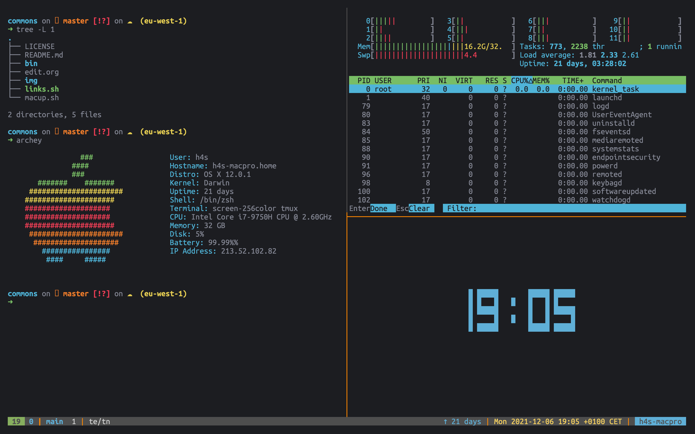
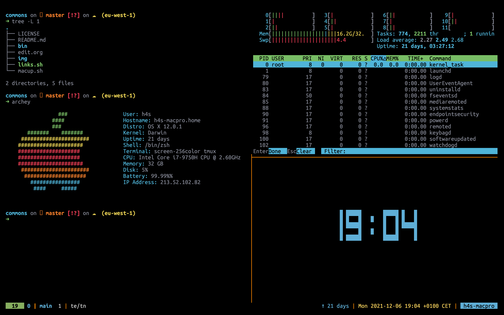

# An Old Hope (alacritty)

This is a color theme for [alacritty](https://github.com/alacritty/alacritty), based off the initial [Atom Theme by jesseleite](https://github.com/jesseleite/an-old-hope-syntax-atom).

Two themes are provided:

- an-old-hope.yml
- an-old-hope-black.yml

The only difference the the "black" variation is the background is true black.

## usage

    curl https://raw.githubusercontent.com/theherk/an-old-hope-alacritty/main/an-old-hope.yml -o ~/.config/alacritty/an-old-hope.yml

Or, for the black variant:

    curl https://raw.githubusercontent.com/theherk/an-old-hope-alacritty/main/an-old-hope-black.yml -o ~/.config/alacritty/an-old-hope-black.yml

Then in ~/.config/alacritty/alacritty.yml:

``` yaml
import:
  - ~/.config/alacritty/an-old-hope.yml
  # - ~/.config/alacritty/an-old-hope-black.yml #alternately
```

## tmux

I use this in conjunction with [an-old-hope-tmux](https://github.com/theherk/an-old-hope-tmux).

## screenshots




